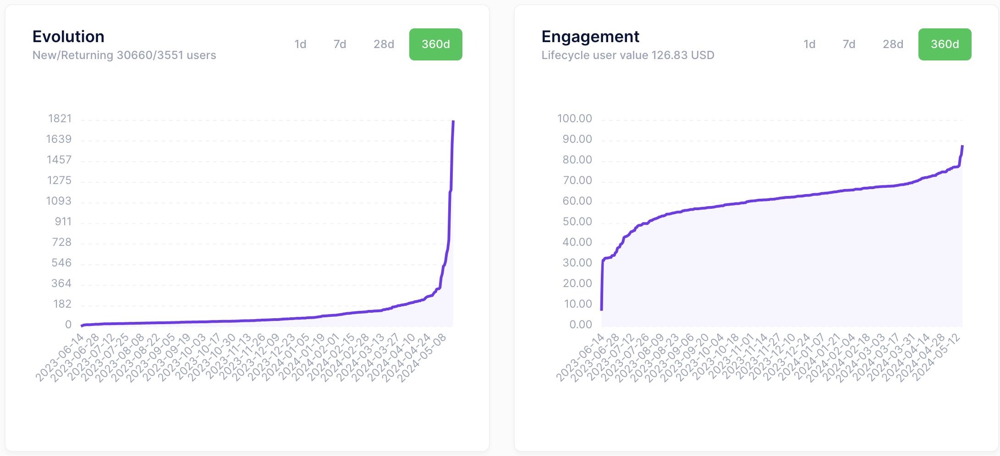

# Google Analytic Laravel

The free Laravel package to help you integrate data with GA4

## Use Cases

- Crawl and parse result from GA4 with reformated and sorted values
- Easy to understand and draw charts
- Example crawler command
- Send data to Google Analytics by Measurement Protocol.

## Features

- Dynamic Google Service credentials from config/google-service.php
- Dynamic Google Analytic properties from config/google-analytic.php
- Easy to crawl data with a simple line code
- Easy to sync your users or products and orders to Google Analytics.

## Know issues

- This package uses the latest official SDK, libraries and methods from Google then it might be large (around 30mb for dependency package google/apiclient) for shared hosting.
- Please consider your server's environment before using this package.
- However, we still recommend that you follow the latest writing style for Google libraries to ensure safety, compliance, CI/CD and most importantly if you are using services

## Requirements

- **PHP**: 8.1 or higher
- **Laravel** 9.0 or higher

## Testing

Run unit tests for this package:

```bash
composer install
./vendor/bin/phpunit
```

## Quick Start

If you prefer to install this package into your own Laravel application, please follow the installation steps below

## Installation

#### Step 1. Install a Laravel project if you don't have one already

https://laravel.com/docs/installation

#### Step 2. Require the current package using composer:

```bash
composer require funnydevjsc/google-analytic-laravel-integrate
```

#### Step 3. Publish the controller file and config file

```bash
php artisan vendor:publish --provider="FunnyDev\GoogleAnalytic\GoogleAnalyticServiceProvider" --tag="google-analytic"
```

If publishing files fails, please create corresponding files at the path `config/google-analytic.php` and `config/google-service.php` and `app\Console\Commands\GoogleAnalyticCommand.php` from this package. And you can also further customize the GoogleAnalyticCommand.php file to suit your project.

#### Step 4. Create a Google Service credentials:

- Go to https://console.cloud.google.com/iam-admin/serviceaccounts?hl=en&project=your_google_project_id to create a Google Service account.
- Go to https://console.cloud.google.com/iam-admin/serviceaccounts/details/your_google_service_account_id/keys?hl=en&project=your_google_project_id to create a JSON private key file like this:


- Then download it to your computer as <code>application_default_credentials.json</code> and move it to the storage_path of Laravel project but don't forget to ignore it from git to secure your project.

#### Step 5. Update the various config settings in the published config file:

- After publishing the package assets a configuration file will be located at <code>config/google-analytic.php</code> and <code>config/google-service.php</code>.
- Please use your Google Service credentials values from <code>application_default_credentials.json</code> to fill into <code>config/google-service.php</code> file.
- Find your Analytic Property ID and fill into <code>config/google-analytic.php</code> file like this:


- Then in this case our Analytic Property ID is <code>281673130</code> which was shown on the current URL.

#### Step 6. Add middleware protection:

###### app/Http/Kernel.php

```php
<?php

namespace App\Http;

use Illuminate\Foundation\Http\Kernel as HttpKernel;

class Kernel extends HttpKernel
{
    // Other kernel properties...
    
    /**
     * The application's route middleware groups.
     *
     * @var array
     */
    protected $routeMiddleware = [
        // Other middlewares...
         'google-analytic' => 'App\Http\Middleware\GoogleAnalyticMiddleware',
    ];
}
```

#### Step 7. Add based view controller:

###### app/Providers/AppServiceProvider.php

```php
<?php

namespace App\Providers;

use Illuminate\Support\Facades\Route;
use Illuminate\Support\Facades\Session;
use Illuminate\Support\Facades\View;
use Illuminate\Support\ServiceProvider;

class AppServiceProvider extends ServiceProvider
{
    ...

    /**
     * Bootstrap any application services.
     */
    public function boot(): void
    {
        ...
        View::addNamespace('google-analytics', base_path('resources/views/vendor/google-analytics'));
        View::share('userData', Session::get('userData') ?? '');
    }
}
```

#### Step 8. Migrate your Analytic Property ID with your Front End:

You can use libraries such as <code>spatie/laravel-googletagmanager</code> to set up GA4 for Front End of the website then declare events and activities of users and businesses using Javascript to trigger those events and send reports to GA.

#### Step 9. Save data to Database and Draw charts:

You can use or optimize <code>app/Console/Commands/GoogleAnalyticCommand.php</code> to retrieve data and store the collected data into the Database for convenience in research, evaluation and drawing charts. Drawing charts is possible through Javascript libraries. Example collected data like this (this data bellow is not real and just for demo only):

```json
{
  "events": { //Trigged when user does something on the website
    "page_view": {
      "users": "2707",
      "counts": "20797"
    },
    "user_engagement": {
      "users": "2020",
      "counts": "16380"
    },
    "scroll": {
      "users": "2034",
      "counts": "13507"
    },
    "session_start": {
      "users": "2705",
      "counts": "9126"
    },
    "first_visit": {
      "users": "2592",
      "counts": "5672"
    },
    "click": {
      "users": "1101",
      "counts": "3572"
    },
    "form_start": {
      "users": "794",
      "counts": "3044"
    },
    "form_submit": {
      "users": "172",
      "counts": "483"
    }
  },
  "users": { //Analyze users information
    "countries": {
      "VN": "1386",
      "US": "308"
    },
    "cities": {
      "Hanoi": "426",
      "Ho Chi Minh City": "302"
    },
    "gender": {
      "male": "653",
      "female": "199",
      "unknown": "1928"
    },
    "ages": {
      "unknown": "1995",
      "18-24": "523",
      "25-34": "169",
      "35-44": "75",
      "45-54": "34",
      "55-64": 0,
      "65+": 0
    },
    "languages": {
      "English": "1328",
      "Vietnamese": "905"
    },
    "favorites": {
      "Technology/Technophiles": "533",
      "Technology/Mobile Enthusiasts": "372"
    },
    "channels": {
      "Direct": "1895",
      "Organic Search": "715",
      "Organic Video": "493",
      "Referral": "156",
      "Organic Social": "105",
      "Paid Search": "71",
      "Unassigned": "57"
    },
    "devices": {
      "types": {
        "desktop": "2001",
        "mobile": "717"
      },
      "brands": {
        "Google": "1465",
        "Apple": "562"
      },
      "names": {
        "Galaxy S23 Ultra": "13",
        "Galaxy S9+": "8"
      },
      "models": {
        "Chrome": "1377",
        "iPhone": "314"
      },
      "os": {
        "Windows": "1775",
        "iOS": "374"
      },
      "versions": {
        "Windows 10": "1301",
        "Windows 11": "430"
      },
      "browsers": {
        "Chrome": "1955",
        "Safari": "248"
      }
    }
  },
  "interaction": { //Analyze user actions
    "average": {
      "session": 1.973175548315205,
      "event": 21.525577711803326
    },
    "active": {
      "2024-05-13": "75",
      "2024-05-12": "71",
      "2024-05-11": "60",
      "2024-01-31": "14",
      "2024-01-30": "9",
      "2024-01-29": "4"
    },
    "sources": {
      "(direct)": "2951",
      "youtube.com": "584",
      "google": "559",
      "l.facebook.com": "69"
    },
    "pages": {
      "https://software.funnydev.vn/": 1511,
      "https://account.funnydev.vn/login": 1029,
      "https://funnydev.vn/": 926
    },
    "referrers": {
      "https://software.funnydev.vn/": 2004,
      "https://funnydev.vn/": 996,
      "https://www.youtube.com/": 543,
      "https://www.google.com/": 466
    },
    "dau-mau": {
      "2024-05-13": "0.4625",
      "2024-05-12": "0.4",
      "2024-05-11": "0.2937062937062937",
      "2024-01-31": "0.017902813299232736",
      "2024-01-30": "0.012676056338028169",
      "2024-01-29": "0.012539184952978056"
    },
    "dau-wau": {
      "2024-05-13": "1",
      "2024-05-12": "0.4625",
      "2024-05-11": "0.37777777777777777",
      "2024-01-31": "0.085271317829457363",
      "2024-01-30": "0.085271317829457363",
      "2024-01-29": "0.027777777777777776"
    },
    "wau-mau": {
      "2024-05-13": "1",
      "2024-05-12": "1",
      "2024-05-11": "1",
      "2024-01-31": "0.16624040920716113",
      "2024-01-30": "0.13988095238095238",
      "2024-01-29": "0.13877551020408163"
    }
  },
  "retention-rate": { //Calculate retention rate of users
    "new": "2592",
    "returning": "653",
    "evolution": {
      "2024-05-13": "235",
      "2024-05-12": "210",
      "2024-05-11": "193",
      "2024-01-31": "186",
      "2024-01-30": "180",
      "2024-01-29": "172"
    },
    "engagement": {
      "2024-05-13": "0.78125",
      "2024-05-12": "0.77611940298507465",
      "2024-05-11": "0.775",
      "2024-05-10": "0.77419354838709675",
      "2024-01-31": "0.40196078431372551",
      "2024-01-30": "0.34482758620689657",
      "2024-01-29": "0.33333333333333331"
    }
  },
  "business": { //Analyze user actions on products by 4 steps view -> add to card -> purchase -> get revenue
    "products": {
      "viewed": {
        "Product 1": 10000,
        "Product 2": 9000,
        "Product 3": 800,
        "Product 4": 700
      },
      "added": {
        "Product 1": 1000,
        "Product 2": 900,
        "Product 3": 800,
        "Product 4": 700
      },
      "purchased": {
        "Product 1": 100,
        "Product 2": 90,
        "Product 3": 80
      },
      "revenue": {
        "Product 1": 10,
        "Product 2": 9,
        "Product 3": 8
      }
    },
    "promotional": {
      "Promotion of Product 1": 500,
      "Promotion of Product 2": 400
    }
  }
}
```

And some demo charts:





<!--- ## Usage --->

## Testing

Crawl data from Google Analytic

``` bash
php artisan google-analytic:crawl
```

Sync GA4 client_id (read-only)
``` bladehtml
<head>
    @include('googletagmanager::head')
    ...
</head>
<body>
    @include('googletagmanager::body')
    @include('google-analytics::sync_client_id')
    ...
    @include('google-analytics::scripts')
</body>
```

Send view_item event of authenticated user to Google Analytic

``` php
namespace App\Listeners\Product;

use App\Events\Product\ViewProductEvent;
use FunnyDev\GoogleAnalytic\GoogleAnalyticSdk;

class ViewProductListener
{
    /**
     * Handle the event.
     * @throws \Exception
     */
    public function handle(ViewProductEvent $event): void
    {
        $product = $event->product;
        $price = floatval($product->amount);
        $discount = match ($product->quantity) {
            6 => $price,
            12 => $price * 2,
            default => 0
        };
        $items = [
            [
                'item_id' => $product->id.'_'.$product->quantity,
                'item_name' => $product->name,
                'price' => $price,
                'item_brand' => $product->name,
                'item_category' => $product->type,
                'item_variant' => ($product->type == 'Software') ? 'license' : 'script',
                'quantity' => $product->quantity,
                'discount' => floatval($discount)
            ]
        ];

        [$clientId, $userId] = GoogleAnalyticSdk::resolveIdsFromRequest();
        $userProperties = GoogleAnalyticSdk::resolveUserPropertiesFromRequest();

        GoogleAnalyticSdk::sendReport(
            client_id: $clientId,
            user_id: $userId,
            name: 'view_item',
            params: [
                'currency' => 'USD',
                'value' => ($price * $product->quantity) - $discount,
                'items' => $items,
            ],
            user_properties: $userProperties,
        );
    }
}
```

## Feedback

Respect us in the [Laravel Việt Nam](https://www.facebook.com/groups/167363136987053)

## Contributing

Please see [CONTRIBUTING](CONTRIBUTING.md) for details.

### Security

If you discover any security related issues, please email contact@funnydev.vn or use the issue tracker.

## Credits

- [Funny Dev., Jsc](https://github.com/funnydevjsc)
- [All Contributors](../../contributors)

## License

The MIT License (MIT). Please see [License File](LICENSE.md) for more information.
